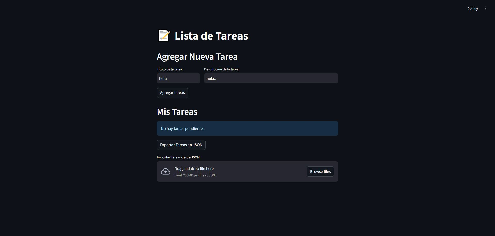

# To-Do List
Aplicación para gestionar tareas. Permite agregar, editar, marcar como completadas y eliminar tareas. También ofrece opciones para importar tareas en formato JSON y exportar las tareas actuales.

## **Contenido**
- `app.py` Interfaz en Streamlit para gestionar tareas (agregar, ver, editar, eliminar, exportar/importar en formato JSON).
- `crud.py` Gestiona tareas con operaciones CRUD (crear, leer, actualizar, eliminar) usando SQLAlchemy.
- `database.py` Conexión y creación de la base de datos, gestión de sesiones con SQLAlchemy.
- `model.py` Define el modelo de datos para la tabla todolist en la base de datos (ID, título, tarea, estado de completado).

## **Ambiente de desarrollo**
- [Python](https://www.python.org/)
- [VisualStudioCode](https://code.visualstudio.com/)
- [Streamlit](https://streamlit.io/)
- [Sqlite](https://www.sqlite.org/)

## **Librerias usadas**
> 📢 Principalmente pondré estas tres librerias, en el archivo `requirements.txt` aparecen más debido a estas librerias descargan otras para funcionar.
- [SQLAlchemy](https://www.sqlalchemy.org/)
- [Streamlit](https://streamlit.io/)
- [SQLAlchemy-Utils](https://sqlalchemy-utils.readthedocs.io/en/latest/)

## **Funcionamiento**
1. Abre el terminal en la carpeta del proyecto. Si no aparece, usa ``cd '<ruta>'`` en PowerShell.
2. Crea un entorno virtual con ``python -m venv <nombre del entorno>``, luego actívalo con ``<nombre del entorno>\Scripts\activate``.
3. Instala las dependencias con ``pip install -r requirements.txt``.
4. Corre la aplicación con ``streamlit run app.py``. La interfaz es intuitiva, donde puedes agregar tareas, completarlas, eliminarlas, e importar/exportar tareas en formato JSON.

## Imagen del proyecto
